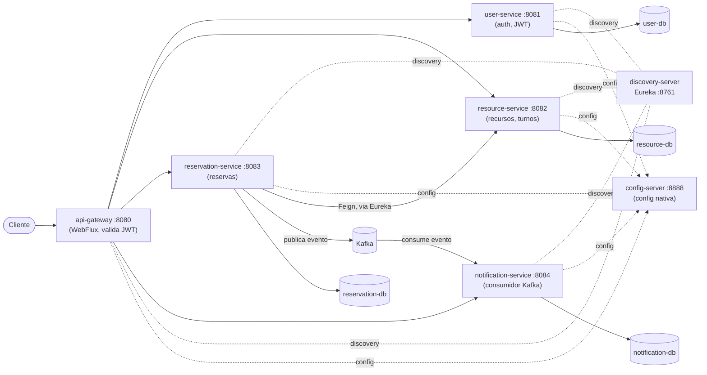

# Sistema de Reservas — Microservicios con Spring Boot & Spring Cloud


Sistema de reservas de recursos (canchas, salas, equipos) construido como una arquitectura de
microservicios real, no un CRUD monolítico. Pensado como proyecto de portfolio para demostrar
un progresión de complejidad: seguridad, service discovery, configuración centralizada,
comunicación síncrona (Feign) y asíncrona (Kafka), testing contra bases de datos reales, y
despliegue containerizado con CI.

## Arquitectura



**Flujo típico**: un usuario se autentica en `user-service` (JWT), reserva un turno a través del
`api-gateway`; `reservation-service` valida y bloquea el turno llamando a `resource-service` de
forma síncrona (Feign, resuelto dinámicamente vía Eureka — sin URLs fijas), y una vez confirmada
la reserva publica un evento a Kafka que `notification-service` consume de forma asíncrona para
generar la notificación. Cada servicio valida el JWT de forma independiente (defensa en
profundidad), y cada uno tiene su propia base de datos (database-per-service).

## Stack

- **Java 21** / **Spring Boot 3.3.4** / **Spring Cloud 2023.0.3**
- **Spring Cloud**: Eureka (discovery), Config Server (config centralizada, backend nativo),
  Gateway (routing reactivo), OpenFeign + LoadBalancer (comunicación síncrona entre servicios)
- **Seguridad**: Spring Security + JWT (jjwt), BCrypt, roles (`ROLE_USER` / `ROLE_ADMIN`)
- **Persistencia**: Spring Data JPA / Hibernate, PostgreSQL (producción/docker), H2 (dev local)
- **Mensajería**: Apache Kafka (modo KRaft, sin Zookeeper) + Spring Kafka
- **Testing**: JUnit 5, Mockito, MockMvc, tests de integración contra Postgres real,
  `@EmbeddedKafka`
- **Infraestructura**: Docker, Docker Compose, GitHub Actions (CI)
- **Build**: Maven multi-módulo

## Servicios

| Servicio               | Puerto | Responsabilidad                                                  |
|-------------------------|--------|--------------------------------------------------------------------|
| `discovery-server`      | 8761   | Service registry (Eureka)                                          |
| `config-server`         | 8888   | Configuración centralizada (backend nativo, sin git)               |
| `api-gateway`           | 8080   | Punto de entrada único, routing, validación JWT de primera línea   |
| `user-service`          | 8081   | Registro/login, emisión de JWT, gestión de usuarios                |
| `resource-service`      | 8082   | Recursos reservables y sus turnos de disponibilidad                |
| `reservation-service`   | 8083   | Creación/cancelación de reservas, orquesta `resource-service`      |
| `notification-service`  | 8084   | Consume eventos de reserva desde Kafka y genera notificaciones     |
| `common`                | —      | Librería compartida: JWT, principal de autenticación               |

## Cómo correrlo

### Con Docker Compose (recomendado)

Levanta toda la stack: Eureka, Config Server, Gateway, los 4 servicios de negocio, Kafka y un
Postgres dedicado por servicio.

```bash
docker compose up --build
```

Servicios expuestos en el host: gateway `:8080`, eureka `:8761`, config-server `:8888`,
user-service `:8081`, resource-service `:8082`, reservation-service `:8083`,
notification-service `:8084`.

### En local sin Docker

Cada servicio corre con H2 en memoria y no necesita infraestructura externa (Eureka/Kafka son
opcionales para el perfil `local`, ver [Decisiones de diseño](#decisiones-de-diseño)):

```bash
cd discovery-server && mvn spring-boot:run   # opcional
cd config-server && mvn spring-boot:run       # opcional
cd user-service && mvn spring-boot:run
cd resource-service && mvn spring-boot:run
cd reservation-service && mvn spring-boot:run
cd notification-service && mvn spring-boot:run
cd api-gateway && mvn spring-boot:run         # requiere config-server arriba
```

Una cuenta admin (`admin` / `Admin123!`) se crea automáticamente al arrancar `user-service`.

## Probar el flujo completo

```bash
# Login como admin
TOKEN=$(curl -s -X POST http://localhost:8080/api/auth/login \
  -H "Content-Type: application/json" \
  -d '{"username":"admin","password":"Admin123!"}' | grep -o '"token":"[^"]*"' | cut -d'"' -f4)

# Crear un recurso
curl -X POST http://localhost:8080/api/resources -H "Authorization: Bearer $TOKEN" \
  -H "Content-Type: application/json" \
  -d '{"name":"Cancha 1","type":"CANCHA","capacity":4,"location":"Sede Centro"}'

# Registrar un usuario, reservar, ver notificaciones...
```

## Testing

```bash
mvn clean verify
```

Corre los tests unitarios (Mockito) e integración (MockMvc) de todos los módulos. Los tests
`*PostgresIT` (uno por servicio con JPA) se saltean automáticamente si no hay un Postgres de
pruebas corriendo; para ejecutarlos de verdad:

```bash
docker compose up -d postgres-test
mvn clean verify
```

`notification-service` además tiene un test de integración con `@EmbeddedKafka` que publica un
evento real y verifica que se consuma correctamente.

## CI/CD

GitHub Actions (`.github/workflows/ci.yml`) corre `mvn clean verify` en cada push/PR a `main`,
con un contenedor Postgres de servicio para que los tests de integración corran de verdad.

## Decisiones de diseño

- **Sync vs. async**: la creación/cancelación de una reserva usa Feign de forma síncrona
  (consistencia — el bloqueo del turno tiene que confirmarse antes de responder), mientras que
  Kafka se usa solo para el efecto secundario de notificar, que puede ser eventual.
- **Defensa en profundidad**: el gateway rechaza requests sin JWT válido antes de rutear, pero
  cada servicio vuelve a validar el token de forma independiente — el gateway no es el único
  punto de control de seguridad.
- **`common` no lo usa `api-gateway`**: el módulo `common` trae Spring Security (servlet), que
  entra en conflicto con el stack reactivo (WebFlux) del gateway. El gateway tiene su propia
  validación de JWT mínima y autocontenida.
- **Config local vs. centralizada**: los servicios de negocio mantienen su perfil `local`
  (H2, sin infraestructura) autocontenido para que los tests sean rápidos e independientes;
  solo el perfil `docker` se centraliza de verdad en el Config Server.
- **Database per service**: cada servicio tiene su propia base de datos — nunca se accede a
  la tabla de otro servicio directamente, solo vía su API.

## Estructura del repo

```
.
├── common/                 # JWT compartido, principal de autenticacion
├── discovery-server/       # Eureka
├── config-server/          # Spring Cloud Config (nativo)
├── api-gateway/            # Spring Cloud Gateway
├── user-service/
├── resource-service/
├── reservation-service/
├── notification-service/
├── docker-compose.yml
└── .github/workflows/ci.yml
```
